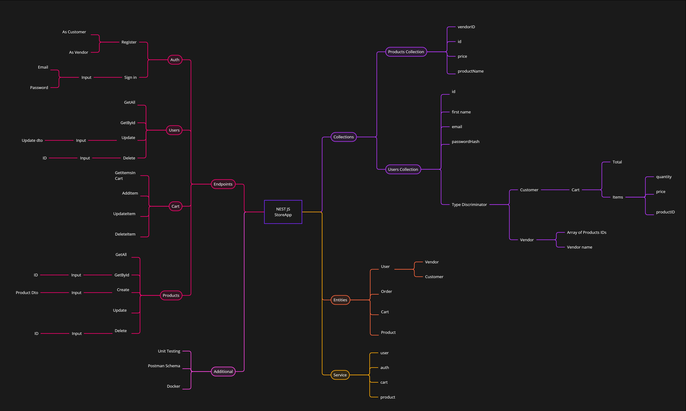

## Nest.Js Api for ECommerce

## Description

Simple nestJS api to add users vendors/customers and products and allows customers to add products to their cart

- Added validation
- Added docker
- Added JWT

## Technologies

### Outline [🔼](#table-of-contents)

For better quality check the file ["Projectmap-NestJS.jpg"](Projectmap-NestJS.jpg)

